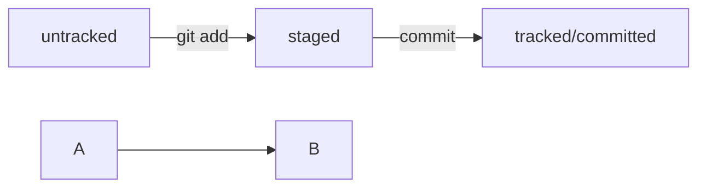

# Git practice

You know, I can write all the things I've learned from the **course** but I think it would be better if you try _Практикум_ yourself so here's my referral link, enjoy:

https://practicum.yandex.ru/referrals/?ref_code=gAAAAABlV1kDDmRCmi5PXDYB_5UZgEjT84a-SEJiKYE4Lx8E1JBm1RsL_07XduT7yKjKvOxilAELcBvKNRdZMeUFoChje-rxDQ%3D%3D

upd:

